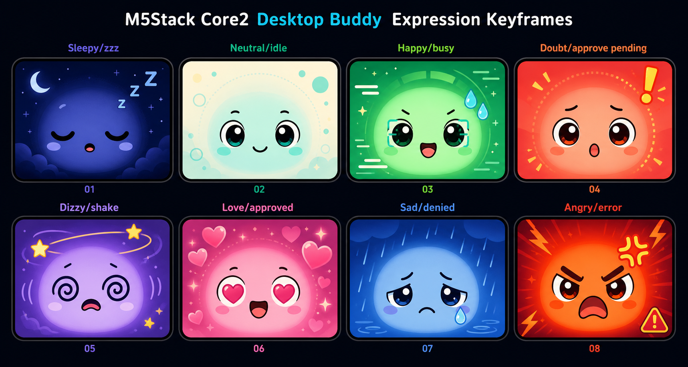

# M5Stack Buddy Expression Animation Redesign

Date: 2026-06-04

## Goal

Redesign the current M5Stack Core2 buddy expressions so they feel colorful,
polished, and stateful instead of simple white drawings on a black background.
The expression set stays unchanged:

- `zzz` / Sleepy
- `idle` / Neutral
- `busy` / Happy
- `approve?` / Doubt
- `dizzy` / Dizzy
- `approved` / Love
- `denied` / Sad
- `error` / Angry

The visual direction approved for implementation is captured in the generated
concept sheet:

## Scope

Implement a render-layer redesign only.

In scope:

- Add color to screen backgrounds, faces, eyes, effect symbols, and state glows.
- Keep every current expression and trigger source.
- Keep the existing state machine priorities and transient durations.
- Preserve LED and vibration behavior unless a tiny timing adjustment is needed
  to match the new visual rhythm.
- Translate the concept sheet into simple firmware drawing primitives that can
  run on Core2: filled rounded rectangles, circles, arcs, triangles, line
  segments, small particle loops, and compact palette interpolation.

Out of scope:

- New expression states.
- Changes to BLE payload shape or approval event semantics.
- New physical controls.
- Photo-like or texture-heavy rendering.
- Full-screen bitmap playback. The firmware should draw procedurally so the
  animations stay small and responsive.

## Visual Language

The new look should read as a tiny AI desk companion living inside a colorful
screen. Each state gets a distinct mood color, while the face shape stays
consistent so the pet remains recognizable.

Common rules:

- Use a soft colored background per state instead of black.
- Use a rounded face panel or glow shape behind the eyes to make the face feel
  intentional on the 320x240 display.
- Keep features large and readable from desk distance.
- Use color sparingly per state: one dominant background, one face color, one or
  two accent colors.
- Avoid dense detail. Every symbol must be drawable with simple geometry.
- Keep the speech bubble label as a fallback during early firmware iterations,
  but the redesigned visuals should be recognizable without reading text.

## Expression Designs

### Sleepy: `zzz`

Trigger:

- BLE central disconnected or no trusted Mac state.
- Connected idle after `kDrowsyAfterMs` currently 60 seconds.

Keyframe:

- Deep indigo background with a dim blue halo.
- Closed crescent eyes.
- Tiny relaxed mouth.
- Three blue-white `Z` symbols drifting upward and right.

Animation:

- Slow background breathing over roughly 2.8 to 3.2 seconds.
- `Z` symbols rise, shrink slightly, and fade by skipping late-cycle draw.
- Face remains still and calm.

Implementation notes:

- Reuse current `Sleepy` expression and `drawZzz`, but colorize it.
- Differentiate disconnected and drowsy later only if needed; this redesign does
  not add a separate expression.

### Neutral: `idle`

Trigger:

- Connected, no running sessions, no pending approvals.

Keyframe:

- Warm off-white or pale teal background.
- Friendly open eyes.
- Small smile.
- Subtle ambient glow around the face.

Animation:

- Restore or preserve natural blink in this state.
- Very slow glow pulse, low amplitude.
- No particles except occasional tiny idle sparkle if it remains unobtrusive.

Implementation notes:

- Neutral should be the quiet baseline.
- Avoid making idle look like a busy or success state.

### Happy: `busy`

Trigger:

- One or more running MiniMax Code sessions and no pending approvals.

Keyframe:

- Green and cyan background.
- Focused scanning eyes with small pupils.
- Small open mouth.
- Workload sweat drops on one side.

Animation:

- Pupils scan left and right.
- Background has a gentle horizontal energy sweep.
- Sweat count scales with `runningSessions`: 1, 2, or 3 drops.
- Drops slide down in a loop.

Implementation notes:

- Preserve current intensity mapping from running count.
- Keep this readable as "working hard", not "panic".

### Doubt: `approve?`

Trigger:

- Pending approval count greater than zero.

Keyframe:

- Coral or red alert background with amber highlight.
- Wide alert eyes.
- Tense raised brows.
- Large exclamation mark above the face.

Animation:

- Exclamation mark blinks in a 600 to 800 ms cycle.
- Background alert aura pulses.
- Pupils subtly pulse.
- Periodic vibration reminder remains about every 6 seconds.

Implementation notes:

- This must be one of the most readable states because it asks for user action.
- Do not make it look like error. Keep it warmer and more "attention please"
  than dangerous.

### Dizzy: `dizzy`

Trigger:

- Local IMU shake.

Keyframe:

- Violet background with yellow star accents.
- Rotating spiral eyes.
- Tilted head.
- Orbiting stars around the top of the face.

Animation:

- Spiral eyes rotate.
- Head rocks side to side.
- Stars orbit in an ellipse.
- Optional wavy background motion.

Implementation notes:

- Keep current transient duration and priority.
- This state may still play while disconnected.

### Love: `approved`

Trigger:

- Device sends approve once or approve always.

Keyframe:

- Pink and magenta background.
- Heart-shaped eyes.
- Happy open mouth.
- Floating hearts and celebratory glow.

Animation:

- Heart eyes pulse like a heartbeat.
- Face bounces lightly.
- Two or three hearts rise and shrink.
- Pink glow pulses with the vibration double tap.

Implementation notes:

- Preserve local optimistic UI behavior after button press.
- Keep it celebratory but short so it falls back quickly to the real daemon
  state.

### Sad: `denied`

Trigger:

- Device sends deny.

Keyframe:

- Rainy blue background with lavender shadows.
- Droopy eyes and worried brows.
- Small frown.
- A large tear falling from one eye.

Animation:

- Slow head shake.
- Tear slides down and loops.
- Background rain streaks or soft vertical motion, implemented with a few simple
  line particles.

Implementation notes:

- Keep the animation gentle, not melodramatic.
- No vibration is required.

### Angry: `error`

Trigger:

- Mac bridge receives `session.error` and sends transient error flag.

Keyframe:

- Hot red-orange warning background.
- Fierce angled eyes and brows.
- Open or clenched angry mouth.
- Pulsing anger mark or warning burst.

Animation:

- Fast head jitter.
- Background flashes between red and orange.
- Anger mark pulses.
- Long buzz remains.

Implementation notes:

- Make it clearly distinct from `approve?`.
- Use higher contrast and faster motion than the pending state.

## Architecture

Current firmware already has useful boundaries:

- `PetStateMachine` chooses `PetVisual`.
- `main.cpp` feeds BLE and local events into the state machine.
- `face_drive.h` drives per-expression avatar parameters.
- `buddy_face.h` swaps per-expression eye drawables.
- `buddy_effect.h` draws overlay symbols through the mouth slot.
- `buddy_fx.h` shares expression, intensity, and time with drawables.

The redesign should extend these render boundaries instead of changing state
logic.

Proposed render modules:

- `buddy_palette.h`: per-expression color palettes and small color helpers.
- `buddy_backdrop.h`: full-screen background and glow drawing.
- Existing custom eyes: update to use palette colors instead of a single primary
  color.
- Existing `BuddyEffect`: update overlay symbols to use palette accent colors.
- `face_drive.h`: tune motion amplitudes for the new look.

Data flow:

1. `PetStateMachine::update(now)` returns `PetVisual`.
2. `main.cpp` writes expression, intensity, and time to `g_buddyFx`.
3. The render path looks up the current palette from `g_buddyFx.expr`.
4. Backdrop, eyes, mouth overlay, LED, and vibration render from the same visual
   state.

## Firmware Drawing Strategy

The Core2 display is 320x240, so the implementation should use procedural
geometry with predictable cost.

Recommended primitives:

- `fillScreen` or large `fillRoundRect` for base backgrounds.
- Low-cost animated stripes, rings, and pulses for state atmosphere.
- `fillCircle`, `fillTriangle`, and `fillRect` for eyes and symbols.
- Avoid per-pixel shaders, large trigonometric loops where not needed, and
  bitmap frame storage.

Performance guardrails:

- Keep animation math simple and bounded.
- Continue the existing `delay(16)` target for roughly 60 FPS.
- Use 8-bit or 16-bit colors already supported by M5Canvas.
- If a state becomes expensive, precompute small lookup tables for repeated
  sine or orbit positions.

## Testing And Verification

Host tests:

- Existing state-machine tests should keep passing.
- Add palette tests only if palette helpers contain non-trivial logic.

Compile verification:

- Run `pio run -e m5stack-core2`.

On-device visual verification:

- Confirm all 8 expressions are distinguishable at normal desk distance.
- Confirm color backgrounds do not make the face unreadable.
- Confirm pending and error are visually distinct.
- Confirm `busy` sweat intensity changes with running count.
- Confirm motion does not flicker or leave trails.
- Confirm the Unit RGB behavior still matches the on-screen mood.

## Acceptance Criteria

- The firmware still exposes the same 8 expression labels and trigger behavior.
- Every expression has a colorful background and at least one state-specific
  animated visual feature.
- Pending approval remains the most attention-grabbing non-error state.
- Error is more urgent than pending and visually distinct from it.
- The implementation compiles for `m5stack-core2`.
- No BLE protocol or approval interaction changes are introduced.

